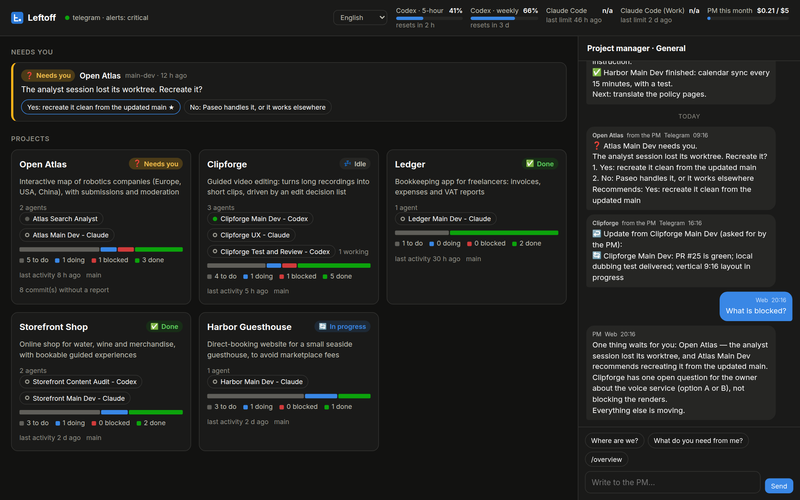

# Leftoff Agents

**Pick up where your AI coding agents left off.**

Leftoff gives every project you run with AI coding agents a **project manager you message like a colleague**. It
knows what Claude Code and Codex did in each repository, tells you when something is finished, blocked or
waiting for you, answers "where are we?" on your phone, and passes your decisions back to the right agent.



> **Status: alpha (0.1).** It runs a real workflow daily, but expect rough edges, and APIs and file formats may
> still change. Built for one person running several projects; it is not a multi-user service.

## The problem

You work on several projects in parallel, each with two or more coding agents running in a terminal, an IDE or
a tool like [Paseo](https://paseo.sh). You touch a project on Monday and again on Thursday, and by Thursday you
no longer know what was done, what is half-finished, what is blocked, or what the agents are waiting for. Agents
never say "I'm done, what next?" on their own, and finding out means opening every session and rereading
transcripts.

In a company, a project manager and a stand-up solve this. Leftoff gives you both, for your agents.

## What it does

- **Agents report, automatically.** Hooks make Claude Code and Codex write a short report after every turn that
  changed something, decided something or learned something. Reports are plain Markdown in your repository.
- **You ask in plain language.** "Where are we on Harbor?", "what got done yesterday?", "what is blocked?" — in
  Telegram, by text or voice, or in the browser. The answer comes from the reports, decisions, backlog and git
  history, with dates, and says "I don't know" rather than guess.
- **It tells you what needs you.** An agent that is blocked or asks a question reaches your phone with the options
  and its recommendation. Everything else waits for the daily stand-up, or for you to ask.
- **You give direction loosely; it writes the prompt.** Say "tell Claude on Harbor to sync every 15 minutes".
  The PM drafts a precise prompt, shows it to you, and sends it only when you say yes.
- **It follows the work.** An agent that has been working for hours without reporting is asked for an update. When a
  subscription limit stops an agent, it is woken again right after the limit resets.
- **A control panel** in the browser: every project, its agents, a sprint board derived from what the agents
  reported, and the PM's conversation — the same one Telegram shows.

## How it works

```
 your coding agents (Claude Code, Codex, … in a terminal, an IDE or Paseo)
    │  hooks: a report after each turn          ▲  your decisions, as the agent's next prompt
    ▼                                           │
 <repo>/.leftoff/   reports, decisions, STATE.md        <repo>/backlog/ (Backlog.md)
    │                                           ▲
    ▼                                           │
 the hub — one small always-on process on the machine that holds your repositories
    • watches every repository and git worktree        • serves the control panel
    • the PM: a model that reads, never edits code     • rations what it sends you
    ▲
    │  Telegram (or the browser)
    ▼
 you
```

Everything that matters is Markdown inside your repositories, readable without Leftoff and versioned with your
code. The hub's own files are only a cache. See [docs/how-it-works.md](docs/how-it-works.md).

## Quick start

You need **Node.js 22.18+** and **git**, on Linux or macOS. Leftoff is not on npm yet, so install it from source:

```bash
git clone https://github.com/maubau/leftoff-agents.git
cd leftoff-agents
npm ci && npm run build && npm link      # puts `leftoff` on your PATH
```

Try the interface first, with invented data and no agents, keys or chat app:

```bash
npm run demo          # then open the address it prints
```

Then set it up for real:

```bash
cd ~/projects/my-project
leftoff init --name "My project" --purpose "What it is for, in one line"
leftoff hosts doctor                    # are the hooks in place?
```

`leftoff init` adds hooks to Claude Code and Codex (backing up every file it touches, and reversible with
`leftoff hosts uninstall`) and writes `.leftoff/`. From then on, after your agents work:

```console
$ leftoff brief
Harbor Guesthouse (harbor)
Direct-booking website for a small seaside guesthouse

codex      ✅ done · 3h ago · main · .leftoff/reports/2026-10-04/1832-codex.md
             done: Form tests, 8 green

claude     ⛔ blocked · 5h ago · main · .leftoff/reports/2026-10-04/1611-claude.md
             done: Booking form with date validation
             doing: Calendar sync from the marketplace feed, about half
             blocked: Need the iCal URL of the listing
             next: Finish the sync, then tests

branch main · 0 dirty · 4 commit(s) in the last 14 days
```

To talk to the project manager, give it a model and a chat. The full walkthrough is in
[docs/getting-started.md](docs/getting-started.md); in short:

```bash
# 1. a key for the PM's model, kept private (any Anthropic key, or an OpenAI-compatible endpoint)
printf 'ANTHROPIC_API_KEY=%s\n' "$KEY" >> ~/.config/leftoff/secrets.env
leftoff pm doctor
leftoff ask "where are we?"             # ask from the terminal, no chat app needed

# 2. Telegram: create a bot with @BotFather, put its token in secrets.env, then
leftoff connect telegram

# 3. keep the hub running
leftoff hub install-service             # a systemd user service on Linux; elsewhere: `leftoff hub`
leftoff web link                        # the address of the control panel
```

## Talking to it

| You say | What happens |
|---|---|
| "where are we on Harbor?" | A short answer from the latest reports, with dates and who did what. |
| "what is blocked?" | The open questions, with options and the agent's recommendation. |
| "tell Claude on Harbor to sync every 15 minutes" | A drafted prompt appears; **yes** sends it, **no** drops it, or say what to change. |
| "add a pricing page to Clipforge" | Tasks are added to the project's To Do list, each with acceptance criteria. |
| *a voice note* | Transcribed, shown back to you, then answered (also by voice if you like). |
| `/overview`, `/quiet on`, `/alerts normal`, `/mute harbor 4`, `/language de` | Chat commands for the cross-project view, quiet hours, how much it pushes, muting, language. |

Leftoff speaks English, Italian, German, French, Spanish and Portuguese ([docs/i18n.md](docs/i18n.md)).

## Works with Paseo — optionally

[Paseo](https://paseo.sh) is an open source control plane for coding agents: desktop, mobile and web apps, isolated git
worktrees, and a CLI. **Leftoff does not need it** — hooks work with agents run anywhere. If you do use Paseo, Leftoff
uses it to see which agents are running, to deliver your instructions live instead of at the agent's next turn, and to
handle each worktree and workspace as its own agent. See [docs/paseo.md](docs/paseo.md). Leftoff is an independent
project, not affiliated with Paseo.

## Supported tools

| | Supported | Notes |
|---|---|---|
| Coding agents | Claude Code, Codex | Any other agent can follow the `AGENTS.md` protocol and `leftoff report`. |
| Chat | Telegram | One group with a topic per project. WhatsApp is planned. |
| Project manager model | Anthropic (default), any OpenAI-compatible endpoint | OpenRouter, Ollama, LM Studio, vLLM… A spending cap protects you. |
| Voice | Deepgram (speech to text, text to speech) | Optional. Audio is sent to Deepgram. |
| Runs on | Linux, macOS | The always-on service uses systemd on Linux. Developed on Ubuntu. |

## Privacy and safety

- **The PM can't act on its own.** It can draft an instruction; only your own "yes", matched against a fixed list of
  words, sends it. What you see is exactly what is sent.
- **Private projects never produce output** in chat or in the panel.
- **No code goes to the model** — only reports, decisions, backlog items and commit summaries — and secrets are
  redacted from anything that leaves the machine.
- **The control panel is private by default:** loopback only, with a password generated on first start.
- **Hooks can't break your agents.** They always exit successfully; a broken Leftoff means no project management,
  never an agent that cannot work.

What does leave your machine: the text the PM reads, to your model provider; messages, through Telegram; voice notes,
to Deepgram if you enable voice. The details, and what Leftoff does *not* protect against, are in
[docs/security.md](docs/security.md).

## Documentation

[Getting started](docs/getting-started.md) · [How it works](docs/how-it-works.md) · [Configuration](docs/configuration.md) ·
[Paseo](docs/paseo.md) · [Security](docs/security.md) · [Control panel](docs/web.md) · [Remote access](docs/remote-access.md) ·
[Report format](docs/protocol.md) · [Languages](docs/i18n.md) · [Design decisions](docs/decisions.md)

## Contributing

Bug reports, ideas and pull requests are welcome — see [CONTRIBUTING.md](CONTRIBUTING.md). `npm test` runs the
whole suite with no network, no model calls and no access to your real agents or files.

## License

[Apache License 2.0](LICENSE). Copyright 2026 Maurizio Caporali.
